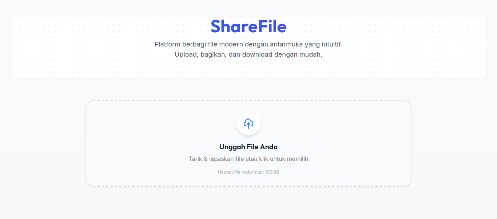

# ShareFile - Platform Berbagi File Modern


ShareFile adalah platform berbagi file modern dengan antarmuka yang intuitif, dibangun dengan Next.js, TypeScript, Supabase dan Tailwind CSS. Aplikasi ini memungkinkan pengguna untuk mengunggah file hingga 100MB, mendapatkan tautan untuk dibagikan, dan mengunduh file dengan tampilan progres real-time.



## ✨ Fitur Utama

- 🚀 **Upload Intuitif**: Drag & drop atau pilih file, dengan progress bar real-time
- 🔗 **Berbagi Instan**: Dapatkan tautan berbagi langsung setelah upload selesai
- ⚡ **Download Cepat**: Pengalaman download yang lancar dengan informasi kecepatan dan waktu
- 📱 **Responsif**: Antarmuka yang berfungsi dengan baik di desktop maupun perangkat mobile
- 🔒 **Sederhana**: Tanpa perlu login, langsung upload dan bagikan

## 🛠️ Teknologi yang Digunakan

- **Frontend**: Next.js 14, React, TypeScript, Tailwind CSS
- **Backend**: Next.js API Routes, Socket.IO
- **Database & Auth**: Supabase (PostgreSQL + Auth + Storage)
- **Styling**: Tailwind CSS dengan komponen kustom
- **File Storage**: Penyimpanan lokal (dapat dikonfigurasi untuk cloud storage melalui Supabase Storage)

## 📋 Prasyarat

Sebelum memulai, pastikan Anda telah menginstal:

- Node.js (versi 18 atau lebih baru)
- npm atau yarn
- Akun Supabase (gratis untuk memulai di [supabase.com](https://supabase.com))

## 🚀 Cara Instalasi

### 1. Clone Repositori

```bash
git clone https://github.com/bimadevs/sharefile.git
cd sharefile
```

### 2. Instal Dependensi

```bash
npm install
# atau
yarn install
```

### 3. Siapkan Supabase

1. Buat akun di [Supabase](https://supabase.com) jika belum memilikinya
2. Buat proyek baru
3. Di dashboard Supabase, ambil URL dan kunci API di bagian Settings > API
4. Buat tabel-tabel berikut melalui Supabase SQL Editor:

```sql
-- Buat tabel users
CREATE TABLE public.users (
  id UUID PRIMARY KEY DEFAULT gen_random_uuid(),
  email TEXT UNIQUE NOT NULL,
  name TEXT,
  created_at TIMESTAMP WITH TIME ZONE DEFAULT NOW(),
  updated_at TIMESTAMP WITH TIME ZONE DEFAULT NOW()
);

-- Buat tabel files
CREATE TABLE public.files (
  id UUID PRIMARY KEY DEFAULT gen_random_uuid(),
  name TEXT NOT NULL,
  original_name TEXT NOT NULL,
  mime_type TEXT NOT NULL,
  size INTEGER NOT NULL,
  path TEXT NOT NULL,
  key TEXT UNIQUE NOT NULL,
  is_public BOOLEAN DEFAULT TRUE,
  created_at TIMESTAMP WITH TIME ZONE DEFAULT NOW(),
  updated_at TIMESTAMP WITH TIME ZONE DEFAULT NOW(),
  user_id UUID REFERENCES public.users(id) ON DELETE SET NULL
);
CREATE INDEX files_user_id_idx ON public.files(user_id);
CREATE INDEX files_key_idx ON public.files(key);

-- Buat tabel download_stats
CREATE TABLE public.download_stats (
  id UUID PRIMARY KEY DEFAULT gen_random_uuid(),
  file_id UUID REFERENCES public.files(id) ON DELETE CASCADE NOT NULL,
  user_id UUID REFERENCES public.users(id) ON DELETE SET NULL,
  ip_address TEXT,
  downloaded_at TIMESTAMP WITH TIME ZONE DEFAULT NOW(),
  completed BOOLEAN DEFAULT FALSE,
  speed INTEGER
);
CREATE INDEX download_stats_file_id_idx ON public.download_stats(file_id);
CREATE INDEX download_stats_user_id_idx ON public.download_stats(user_id);
```

### 4. Konfigurasi Environment Variables

Salin file `.env.example` menjadi `.env` dan sesuaikan dengan pengaturan Anda:

```bash
cp .env.example .env
```

Edit file `.env` dan sesuaikan dengan konfigurasi Supabase Anda:

```bash
# Supabase credentials
NEXT_PUBLIC_SUPABASE_URL="https://your-project-id.supabase.co"
NEXT_PUBLIC_SUPABASE_ANON_KEY="your-anon-key"
SUPABASE_SERVICE_ROLE_KEY="your-service-role-key"

# Batas ukuran file upload (dalam bytes, default 100MB)
MAX_FILE_SIZE="104857600"

# Direktori penyimpanan file
UPLOAD_DIR="uploads"
```

### 5. Jalankan Aplikasi

#### Mode Development

```bash
npm run dev
# atau
yarn dev
```

Aplikasi akan berjalan di `http://localhost:3000`

#### Mode Production

```bash
npm run build
npm start
# atau
yarn build
yarn start
```

## 📁 Struktur Folder

```
sharefile/
├── public/              # Aset statis, ikon
│   └── icons/           # Ikon untuk berbagai tipe file
├── src/                 # Kode sumber utama
│   ├── app/             # Direktori aplikasi Next.js
│   │   ├── api/         # API routes
│   │   │   ├── download/ # Endpoint untuk download file
│   │   │   ├── socket/   # Konfigurasi Socket.IO untuk real-time progress
│   │   │   └── upload/   # Endpoint untuk upload file
│   │   ├── components/   # Komponen React
│   │   ├── download/     # Halaman download file
│   │   ├── lib/          # Utilitas dan konfigurasi
│   │   └── types/        # Type definitions
├── uploads/             # Direktori penyimpanan file yang diupload
├── .env                 # Environment variables
├── .env.example         # Contoh environment variables
├── next.config.js       # Konfigurasi Next.js
├── package.json         # Dependensi dan skrip
├── tailwind.config.js   # Konfigurasi Tailwind CSS
└── tsconfig.json        # Konfigurasi TypeScript
```

## 💿 Penggunaan Aplikasi

1. **Upload File**
   - Kunjungi halaman utama aplikasi
   - Tarik dan lepaskan file ke area upload atau klik untuk memilih file
   - Klik tombol "Upload" untuk mulai mengunggah file
   - Tunggu hingga proses upload selesai

2. **Bagikan File**
   - Setelah upload selesai, Anda akan melihat link download
   - Salin link tersebut dengan mengklik tombol "Salin"
   - Bagikan link kepada siapa saja yang perlu mengakses file Anda

3. **Download File**
   - Klik link download yang diterima
   - Halaman download akan menampilkan informasi file
   - Klik tombol "Download Sekarang" untuk memulai proses download
   - Lihat progress, kecepatan, dan estimasi waktu secara real-time

## 👩‍💻 Pengembangan Lebih Lanjut

### Menggunakan Supabase Storage

Secara default, aplikasi menggunakan penyimpanan lokal. Untuk menggunakan Supabase Storage:

1. Aktifkan Storage di dashboard Supabase Anda
2. Buat bucket baru bernama `file-uploads`
3. Modifikasi `src/app/api/upload/route.ts` untuk menggunakan Supabase Storage
4. Update `src/app/api/download/[key]/route.ts` untuk mengambil file dari Supabase Storage

### Menambahkan Autentikasi

Untuk menambahkan autentikasi dengan Supabase Auth:

1. Aktifkan autentikasi yang diinginkan di dashboard Supabase (Email, OAuth, dll)
2. Gunakan komponen autentikasi Supabase di aplikasi
3. Tambahkan middleware untuk melindungi rute tertentu

## 📝 Konfigurasi Lanjutan

### Mengubah Batas Ukuran File

Edit variabel `MAX_FILE_SIZE` di file `.env` (dalam bytes):

```bash
# 100MB
MAX_FILE_SIZE="104857600"

# 250MB
MAX_FILE_SIZE="262144000"
```

### Mengubah Direktori Penyimpanan

Edit variabel `UPLOAD_DIR` di file `.env`:

```bash
UPLOAD_DIR="custom-uploads-folder"
```

### Mengubah Port Server

Jalankan aplikasi dengan port kustom:

```bash
PORT=4000 npm start
```

## 🐳 Menggunakan Docker (Opsional)

### 1. Buat Dockerfile

```dockerfile
FROM node:18-alpine

WORKDIR /app

COPY package*.json ./
RUN npm install

COPY . .

RUN npm run build

EXPOSE 3000

CMD ["npm", "start"]
```

### 2. Buat Docker Compose

```yaml
version: '3'

services:
  app:
    build: .
    ports:
      - "3000:3000"
    environment:
      - NEXT_PUBLIC_SUPABASE_URL=${NEXT_PUBLIC_SUPABASE_URL}
      - NEXT_PUBLIC_SUPABASE_ANON_KEY=${NEXT_PUBLIC_SUPABASE_ANON_KEY}
      - SUPABASE_SERVICE_ROLE_KEY=${SUPABASE_SERVICE_ROLE_KEY}
    volumes:
      - uploads:/app/uploads

volumes:
  uploads:
```

### 3. Jalankan dengan Docker Compose

```bash
docker-compose up -d
```

## 🤝 Kontribusi

Kontribusi selalu diterima! Jika Anda ingin berkontribusi:

1. Fork repositori
2. Buat branch fitur (`git checkout -b fitur-baru`)
3. Commit perubahan Anda (`git commit -am 'Menambahkan fitur'`)
4. Push ke branch (`git push origin fitur-baru`)
5. Buat Pull Request baru

## 📄 Lisensi

Proyek ini dilisensikan di bawah [MIT License](LICENSE).

## 📞 Kontak

Untuk pertanyaan atau masalah, silakan buka issue di repositori GitHub atau hubungi [alamat email Anda].

---

Dikembangkan dengan ❤️ menggunakan [Next.js](https://nextjs.org/) dan [Supabase](https://supabase.com/)
